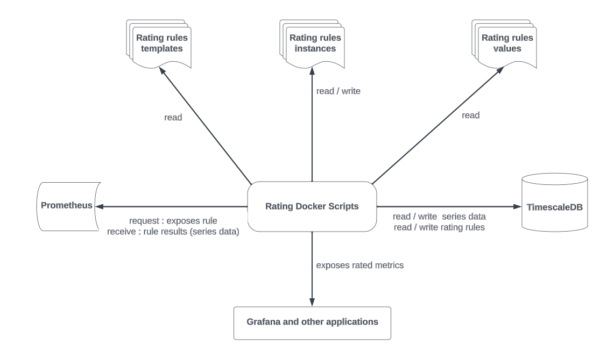
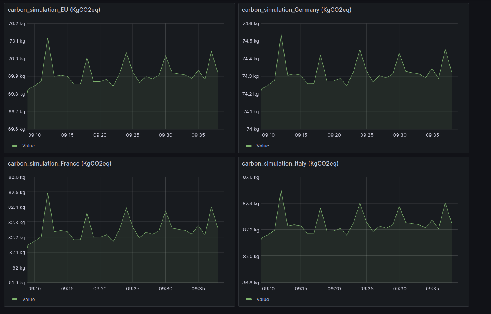

# Overview

`rating-docker` is a Docker service that consume customizable **K**ey **P**erformance **I**ndicator as metrics.


This service is designed for docker environments, if you wish to test this service, you should have docker on your machine.

### Architecture





## **Installation**

Follow these steps to get the project up and running:

Here is the list of prerequisites to be able to start `rating-docker`.


- [Docker](https://www.docker.com/get-started)
- [Docker Compose](https://docs.docker.com/compose/install/)


### Clone the Repository

```bash
git clone https://git.rnd.smile.fr/overboard/5gbiller/rating.docker.git
```


```bash
cd rating.docker

chmod +x start-rating-docker.sh

chmod +x python-scripts/rating_rules_manager.py

chmod +x python-scripts/rating_results_to_json.py

chmod +x python-scripts/test_rating_results.py
```


### Start Rating Docker 


```bash
./start-rating-docker.sh
```

This script launches the necessary services defined in the `docker-compose.yml` file, including Prometheus, Grafana, Node Exporter, and TimescaleDB. And exposes rating rules defined in the configuration file to prometheus.

- Prometheus is accessible at [http://localhost:9090](http://localhost:9090).
- Grafana is accessible at [http://localhost:3000](http://localhost:3000). 


## **Runtime options**


The **rating_rules_manager.py** script is designed to manage Prometheus metric rating rules specified in YAML files. It provides functionalities to add, remove, and update rating rules.

- **Add option :**
adds a new rating rule instance, and exposes it to prometheus.
 

  ```bash
  ./rating_rules_manager.py --add /path/to/rating/rule.yaml
  ```

- **Remove option :** Removes an existing rating rule instance

  ```bash
  ./rating_rules_manager.py --rm /path/to/rating/rule.yaml 
  ```

- **Update option :**  updates an existing rating rule instance, and exposes it to prometheus.  

  ```bash
  ./rating_rules_manager.py --update /path/to/rating/rule.yaml 
  ```

- **Instance creation from template and value:** 

Creates a rating rules instance from a rating rules template and a rating rule value.

  ```bash
  ./rating_rules_manager --templates /path/to/template.yaml --values /path/to/value.yaml --instance /path/to/instance.yaml
  ```
  or 

  ```bash
    ./rating_rules_manager -t /path/to/template.yaml -v /path/to/value.yaml -i /path/to/instance.yaml
  ```

| Option            | Description                                                           | Example Usage                                      |
|-------------------|-----------------------------------------------------------------------|-----------------------------------------------------|
| `--add`           | Adds a new rating rule instance and exposes it to Prometheus.         | `./rating_rules_manager.py --add /path/to/rating/rule.yaml` |
| `--rm`            | Removes an existing rating rule instance.                             | `./rating_rules_manager.py --rm /path/to/rating/rule.yaml` |
| `--update`        | Updates an existing rating rule instance and exposes it to Prometheus.| `./rating_rules_manager.py --update /path/to/rating/rule.yaml` |
| `-t` or `--templates` | Path to rating rules template(s) for instance creation.             | `./rating_rules_manager.py -t /path/to/template.yaml -v /path/to/value.yaml -i /path/to/instance.yaml` |
| `-v` or `--values` | Path to rating rules value(s) for instance creation.                 | `./rating_rules_manager.py -t /path/to/template.yaml -v /path/to/value.yaml -i /path/to/instance.yaml` |
| `-i` or `--instance`| Path to store the created rating rule instance.                      | `./rating_rules_manager.py -t /path/to/template.yaml -v /path/to/value.yaml -i /path/to/instance.yaml` |


## Notes

- The `config.env` file contains the path to the folder containing your rating rules YAML files. Adjust this file if your rules are stored in a different location.


##### **Config file**

Use `config.env` to define the path to the rating rules.


```env
# .env file

RULES_FOLDER=./rating-rules  
```

## Configuration details
##### **Node exporter configuration**

Use the node-exporter.yaml file if you want to add collectors not enabled by default in node-exporter.


exhaustive list of collectors : https://github.com/prometheus/node_exporter


```yaml
collectors:
  - collector name:
  
```
##### **Prometheus configuration**

 

```yaml
global:
  scrape_interval: 15s

scrape_configs:
  - job_name: 'node-exporter'
	static_configs:
  	- targets: ['node-exporter:9100']  # Use the service name defined in your docker-compose.yml

  - job_name: 'prometheus'
	static_configs:
  	- targets: ['localhost:9090']

```


## Minimal example


The `rating-rules` repository contains four rating rules instances which transform system resources into CO2.

Each file in represents a country, i.e. : 
- rating-carbon-FRANCE-instance.yaml : France

- rating-carbon-ITALY-instance.yaml : Italy

- rating-carbon-DEUTCH-instance.yaml : Germany

- rating-carbon-EUROPE-instance.yaml : EU.


 Prometheus is accessible at [http://localhost:9090](http://localhost:9090).

 Grafana is accessible at [http://localhost:3000](http://localhost:3000).





## Use Case Coverage

| Use Case                   | Status          |
|----------------------------|-----------------|
| Start witout rating rules instances        | ✔️ Covered       |
| Start with rating rules instances        | ✔️ Covered       |
| Remove at runtime a rating rule instance      | ✔️ Covered       |
| Update at runtime a rating rule instance      | ✔️ Covered       |
| Add at runtime a rating rule instance     | ✔️ Covered       |
| Create at runtime a rating rule instance from templates and values | ✔️ Covered       |
| update at runtime a rating rule template/value     | ❌ Not Covered   |


## Wiki

technical aspects [Wiki](https://git.rnd.smile.fr/overboard/5gbiller/rating.docker/-/wikis/home).

## Uninstallation

To stop and remove the Docker containers, use:

```bash
docker-compose down
```


